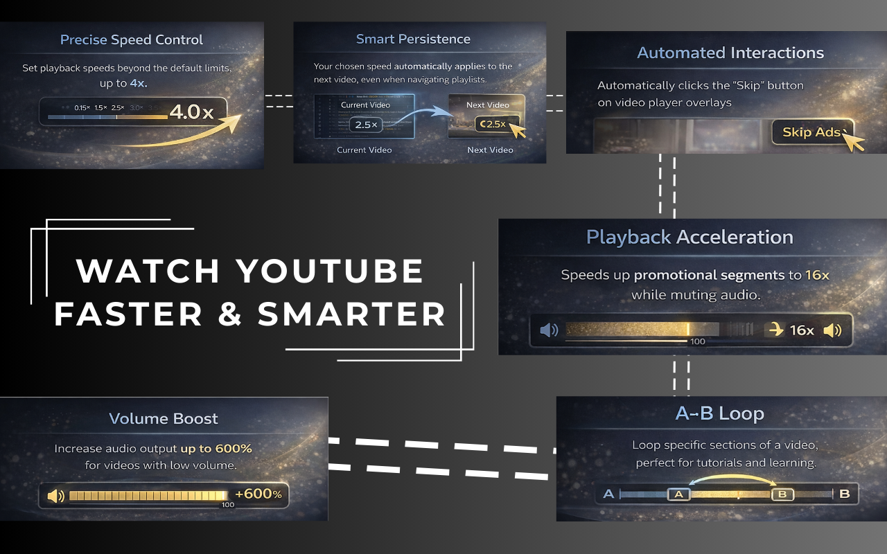

# ⚡ YouTube Quick Speed

[](https://github.com/bhargav1997/youtube-quick-speed/stargazers)
[](https://github.com/bhargav1997/youtube-quick-speed/network/members)
[](https://github.com/bhargav1997/youtube-quick-speed/watchers)
[](https://github.com/bhargav1997/youtube-quick-speed/issues)

**YouTube Quick Speed** is a powerful, privacy-first Chrome extension designed to give you **full control over your YouTube experience** — from advanced playback controls to intelligent focus filtering.

👉 **Try it here:**
🔗 [https://youtube-quick-speed.vercel.app/](https://youtube-quick-speed.vercel.app/)



---

## 🚀 Core Features

* **🏎 Precise Speed Control**
  Set playback speed up to **4×** (beyond YouTube’s default 2×).

* **⏩ Auto-Skip Ads**
  Automatically clicks the “Skip Ad” button when available.

* **⚡ Speed Up Ads**
  Detects ads and temporarily speeds them up to **16×** while muting audio.

* **📢 Volume Booster**
  Boost audio volume up to **600%** for low-volume videos.

* **🔁 A-B Loop**
  Loop specific sections for learning, practice, or review — perfect for musicians and developers.

* **💾 Smart Persistence**
  Playback speed stays consistent across videos and playlists.

* **🌑 Dark Mode UI**
  Modern popup UI designed to blend with YouTube’s dark theme.

---

## 🧠 NEW: Advanced Focus Filter (Productivity Mode)

Take control of *what* YouTube shows you — not just how fast you watch.

### 🎯 Custom Block Categories

* Create your own categories (e.g. **Politics**, **K-Pop**, **Clickbait**)
* Assign:

  * Custom names
  * Multiple keywords
  * Unique icons
* Fully user-controlled and editable

### ⚡ Preset Categories (One-Click)

Instantly block common distractions with built-in presets:

* Shorts
* Food
* Tech
* AI
* Spiritual
* Gaming

### ✨ Premium Blur Mode

Blocked videos are **elegantly blurred** instead of removed:

* Glass-morphism overlay
* “Filtered” label
* Click **Show Video** to preview temporarily

### 🔒 Strict Mode

For maximum focus:

* Completely removes blocked videos (`display: none`)
* No gaps
* No empty spaces
* Clean, distraction-free grid

---

## 🛠 NEW: Video Utilities

### 📸 Smart Snapshot

Capture the perfect frame instantly.

* Takes a **high-resolution screenshot** of the current video frame
* Automatically **excludes player controls**
* One-click download
* Available directly from the **Tools** tab

Perfect for:

* Tutorials
* Slides
* Notes
* Reference material

---

## 📥 Installation

### Chrome Web Store (Recommended)

👉 **Direct Download:**
[https://chromewebstore.google.com/detail/fgfnblagkjbhdkdomhgjhljdaekajocg](https://chromewebstore.google.com/detail/fgfnblagkjbhdkdomhgjhljdaekajocg)

---

### Manual Installation (Developer Mode)

1. Clone or download this repository
2. Open Chrome → `chrome://extensions`
3. Enable **Developer Mode**
4. Click **Load unpacked**
5. Select the project folder
6. Pin the extension to your toolbar

---

## 🛠 Usage

1. Open any video on **youtube.com**
2. Adjust playback speed or volume from the popup
3. Enable **Auto-Skip Ads** or **Speed Up Ads**
4. Use **A / B Loop** to repeat important sections
5. Configure **Focus Filters** to block unwanted content
6. Use **Smart Snapshot** to capture frames instantly

---

## 🔒 Privacy Policy

This extension is built with a **strict privacy-first philosophy**.

* ✅ No data collection
* ✅ No tracking
* ✅ No analytics
* ✅ No external servers
* ✅ 100% local execution

Your data never leaves your browser.

---

## 💻 Tech Stack

* **Manifest V3** – Modern Chrome Extension architecture
* **Vanilla JavaScript** – Lightweight & fast
* **CSS3** – Modern styling with dark-mode support

---

## 🤝 Contributing

This project is **fully open source** and contributions are welcome 🎉

**Repository:**
🔗 [https://github.com/bhargav1997/youtube-quick-speed](https://github.com/bhargav1997/youtube-quick-speed)

### How to Contribute

1. Fork the repository
2. Create a feature branch

   ```bash
   git checkout -b feature/AmazingFeature
   ```
3. Commit your changes

   ```bash
   git commit -m "Add AmazingFeature"
   ```
4. Push to your branch
5. Open a Pull Request

Have an idea or found a bug?
👉 Open an **Issue** — feedback is always welcome.

---

## 📝 License

Licensed under the **MIT License**.
Free to use, modify, and distribute.

---
